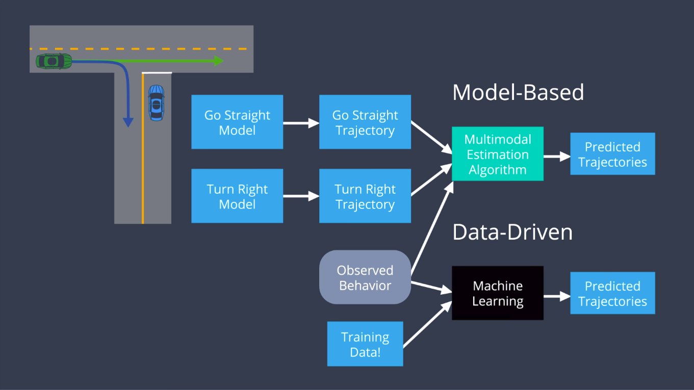
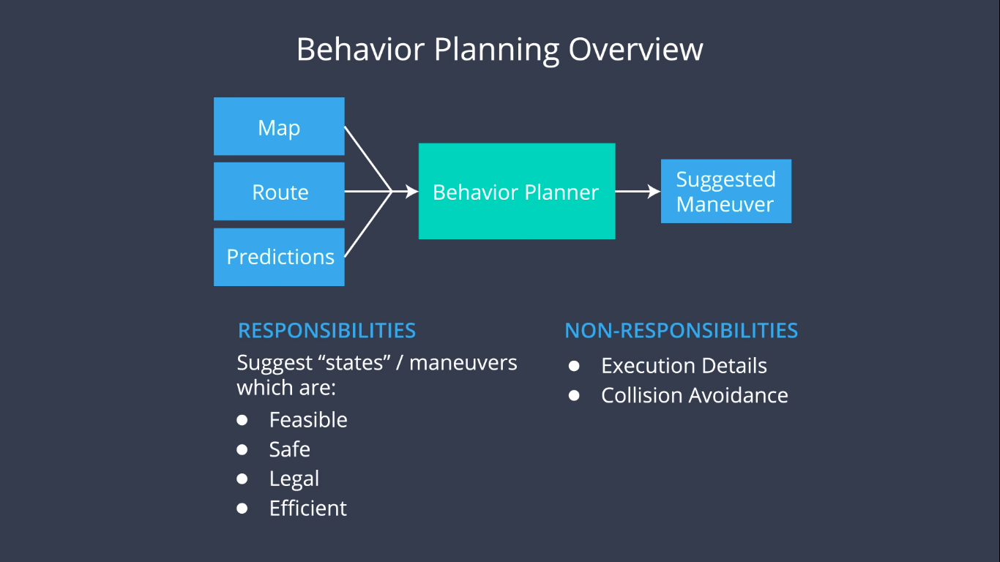
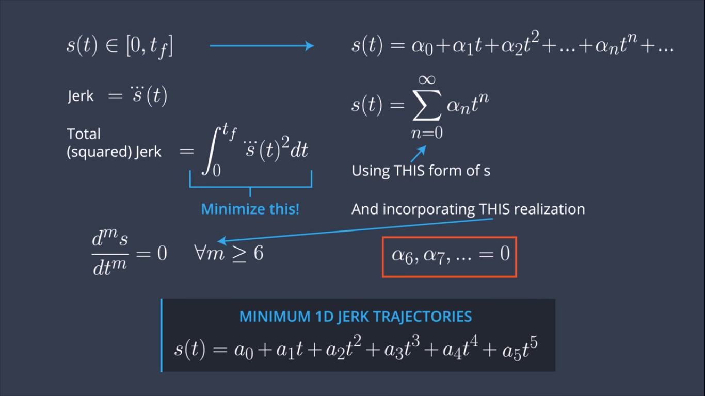
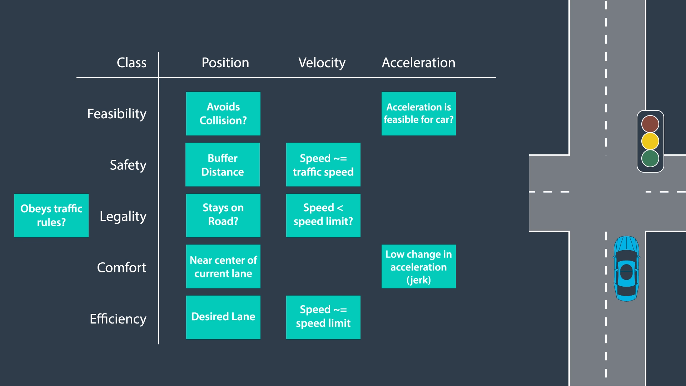

# CarND-Path-Planning-Project
Self-Driving Car Engineer Nanodegree Program
   

[//]: # (Image References)
[Architecture]: ./pictures/Architecture.png
[Prediction]: ./pictures/Prediction.png
[Behavior]: ./pictures/Behavior.png
[Trajectory]: ./pictures/Trajectory.png
[Cost]: ./pictures/Cost.png

## Goals
In this project your goal is to safely navigate around a virtual highway with other traffic that is driving +-10 MPH of the 50 MPH speed limit. You will be provided the car's localization and sensor fusion data, there is also a sparse map list of waypoints around the highway. The car should try to go as close as possible to the 50 MPH speed limit, which means passing slower traffic when possible, note that other cars will try to change lanes too. The car should avoid hitting other cars at all cost as well as driving inside of the marked road lanes at all times, unless going from one lane to another. The car should be able to make one complete loop around the 6946m highway. Since the car is trying to go 50 MPH, it should take a little over 5 minutes to complete 1 loop. Also the car should not experience total acceleration over 10 m/s^2 and jerk that is greater than 10 m/s^3.


## Project Description
The modules that I've built for this project can be calssified into:
* map interpolation
* prediction
* behavior planning
* trajectory generation
* cost ranking

### Map Interpolation [source file](./src/map.cpp)
The map provided is very coarse, around $181$ points for the whole path $6945.554$ km. We need a more accurate map to provide a safe and efficient path planning. To ahieve such a goal, we need to interpolate via spline function. 
```cpp
void Map::read()
{
    ifstream in_map_(map_file_.c_str(), ifstream::in);

    string line;

    // Load up map values for waypoint's x,y,s and d normalized normal vectors
    while (getline(in_map_, line)) {
        istringstream iss(line);
        double x, y;
        float s, d_x, d_y;
        iss >> x;
        iss >> y;
        iss >> s;
        iss >> d_x;
        iss >> d_y;

        map_waypoints_x.push_back(x);
        map_waypoints_y.push_back(y);
        map_waypoints_s.push_back(s);
        map_waypoints_dx.push_back(d_x);
        map_waypoints_dy.push_back(d_y);
    }
    assert(map_waypoints_x.size() && "map not loaded, probably path include is missing");

    // to get a good spline approximation on last segment wrapping around
    map_waypoints_x.push_back(map_waypoints_x[0]);
    map_waypoints_y.push_back(map_waypoints_y[0]);
    map_waypoints_s.push_back(max_s_+map_waypoints_s[0]);
    map_waypoints_dx.push_back(map_waypoints_dx[0]);
    map_waypoints_dy.push_back(map_waypoints_dy[0]);

    map_waypoints_x.push_back(map_waypoints_x[1]);
    map_waypoints_y.push_back(map_waypoints_y[1]);
    map_waypoints_s.push_back(max_s_+map_waypoints_s[1]);
    map_waypoints_dx.push_back(map_waypoints_dx[1]);
    map_waypoints_dy.push_back(map_waypoints_dy[1]);


    spline_x.set_points(map_waypoints_s, map_waypoints_x);
    spline_y.set_points(map_waypoints_s, map_waypoints_y);
    spline_dx.set_points(map_waypoints_s, map_waypoints_dx);
    spline_dy.set_points(map_waypoints_s, map_waypoints_dy);

    // remove last point so we do not have duplicates (x,y): it was just for spline continuity at wraparound
    map_waypoints_x.pop_back();
    map_waypoints_y.pop_back();
    map_waypoints_s.pop_back();
    map_waypoints_dx.pop_back();
    map_waypoints_dy.pop_back();

    map_waypoints_x.pop_back();
    map_waypoints_y.pop_back();
    map_waypoints_s.pop_back();
    map_waypoints_dx.pop_back();
    map_waypoints_dy.pop_back();

    // new map with higher precision: 1 point every 1 meter (instead of every 30 meters)
    new_map_waypoints_x;
    new_map_waypoints_y;
    new_map_waypoints_dx;
    new_map_waypoints_dy;
    for (double s = 0; s <= floor(max_s_); s++) {
        double x = spline_x(s);
        double y = spline_y(s);
        double dx = spline_dx(s);
        double dy = spline_dy(s);

        new_map_waypoints_x.push_back(x);
        new_map_waypoints_y.push_back(y);
        new_map_waypoints_dx.push_back(dx);
        new_map_waypoints_dy.push_back(dy);
    }
}
```
After interpolation, we are able to get a map with precision $1$ m per point. At the same time, we can use **spline** function to help realize the conversion from Cartesian coordinates to Frenet coordinates.

### Predictions [source file](./src/predictions.cpp)

There are two ways to realize the prediction function: model-based approach and data-driven approach.

Here I adopt the model-based approach and use the simplest model.
```cpp
vector<Coord> prediction;
for (int j = 0; j < horizon; j++){
    Coord coord;
    coord.x = x + vx * j*GLOBAL_TS;
    coord.y = y + vy * j*GLOBAL_TS;
    prediction.push_back(coord);
}
predictions_[fusion_index] = prediction;
```

In the future, I will try to combine the data-driven approach to provide better results.

### Behavior Planning [source file](./src/behavior.cpp)

For simplicity, I provide at mose $9$ possible candidates for trajectory generation.
* Keep Current Lane: constant speed, accelerate with maximum acceleration, decelerate with maximum deceleration
* Change Lane Left: constant speed, accelerate with maximum acceleration, decelerate with maximum deceleration
* Change Lane Right: constant speed, accelerate with maximum acceleration, decelerate with maximum deceleration

I will generate trajectories for these candidates and rank them with designed cost functions.

### Trajectory Generation [source file](./src/trajectory.cpp)

Here, I implement the jerk minimum trajectory presented in the lessons to generate $(s, d)$ points for all of the $9$ candidates.

### Cost Ranking [source file](./src/cost.cpp)

I divide the cost functions into the following categories:
* Feasibility: avoid collision. This is my primary concern. I will compare the trajectory generated of the ego vechile and predicted path of other vichicles to avoid any collision. The coorsponding weight is set highest as 1e5. The acceleration and jerk requirements have taken into account in the path planning stage.
* Safety: None
* Legality: I consider the legality during the path planning stage: stay on road and speed less than the speed limit.
* Comfort: The trajectory generated is jerk minimized.
* Efficiency: The most efficient path is the one without vehicle ahead in the filed of view. And the cost is set as 10.

After compare the cost for the $9$ candidates. I will choose the one with minimum cost.

### Future Improvements
* **predictions**: combine data-driven approach with model-based method to provide better predictions
* **behavior planning**: use the finite state machine to provide better planning
* **cost ranking**: design robust and more efficient cost functions to choose the best behavior and trajectory

### References
* [Optimal Trajectory Generation for Dynamic Street Scenarios in a Frenet Frame](https://pdfs.semanticscholar.org/0e4c/282471fda509e8ec3edd555e32759fedf4d7.pdf)
* [Towards Fully Autonomous Driving: Systems and Algorithms](https://www.cs.cmu.edu/~zkolter/pubs/levinson-iv2011.pdf)
* [Collision Detection: Separating Axis Theorem]( http://www.dyn4j.org/2010/01/sat/)
* [Planning the path for a Self-Driving Car on a Highway](https://towardsdatascience.com/planning-the-path-for-a-self-driving-car-on-a-highway-7134fddd8707) by Priya Dwivedi.
* [Udacity Self-Driving Car Nanodegree Project 11 - Path Planning - Part 1](http://jeremyshannon.com/2017/08/25/udacity-sdcnd-path-planning-pt1.html) by Jeremy Shannon.
* [Udacity Self Driving Car ND Path Planning Project](https://medium.com/@philippe.weingertner/udacity-self-driving-car-nd-path-planning-project-6558f6d77887) by Philippe W.


